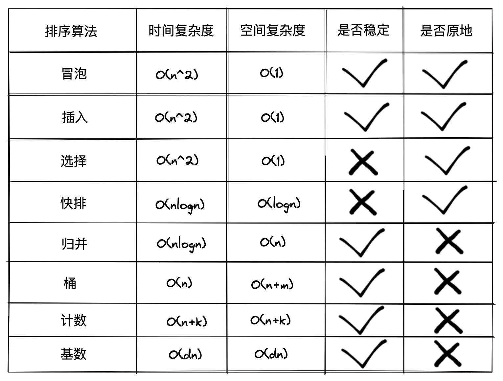

# 排序

## 常用排序算法性能对比



## 冒泡排序

```js
function bubleSort(nums) {
  const n = nums.length;
  for (let i = 0; i < n; i++) {
    for (let j = 0; j < n-1; j++) {
      if (nums[j] > nums[j+1]) {
        const temp = nums[j];
        nums[j] = nums[j+1];
        nums[j+1] = temp;
      }
    }
  }
}

// 优化
function bubleSort(nums) {
  const n = nums.length;
  // 每次外层循环结束，会确定未排序元素中的最大值
  for (let i = 0; i < n; i++) {
    // 是否有数据交换
    let flag = false;
    // 内层循环遍历完成以后，会把最大值换到最右边，因此最右边是有序的，不需要再去比较了
    for (let j = 0; j < n - 1 - i; j++) {
      // 表示有交换
      if (nums[j] > nums[j+1]) {
        const temp = nums[j];
        nums[j] = nums[j+1];
        nums[j+1] = temp;
        flag = true;
      }
    }
    // 没有交换提前退出
    if (!flag) break;
  }
}
```

## 插入排序

```js
function insertionSort(nums) {
  const n = nums.length;
  if (n <= 1) return nums;
  // 每次外层循环会使左边的有序数组长度加1
  for (let i = 1; i < n; i++) {
    const value = nums[i];
    let j = i+1;
    for(; j >= 0; j--) {
      // 当前值比有序数组中的值大，有序数组往后移动，
      if (nums[j] > value) {
        nums[j+1] = nums[j];
      } else {
        break;
      }
    }
    // 把值插入有序数组中空出来的位置
    nums[j+1] = value;
  }
}
```

## 选择排序

```js
function selectionSort(nums) {
  const n = nums.length;
  // 外层比较会得到未排序数组中的最小值放入数组的左边
  // 最后一个值的时候，数组已经有序，因此外层循环次数为n-1
  for (let i = 0; i < n-1; i++) {
    for (let j = i+1; j < n; j++) {
      if (nums[i] > nums[j]) {
        const temp = nums[i];
        nums[i] = nums[j];
        nums[j] = temp;
      }
    }
  }
}
```
